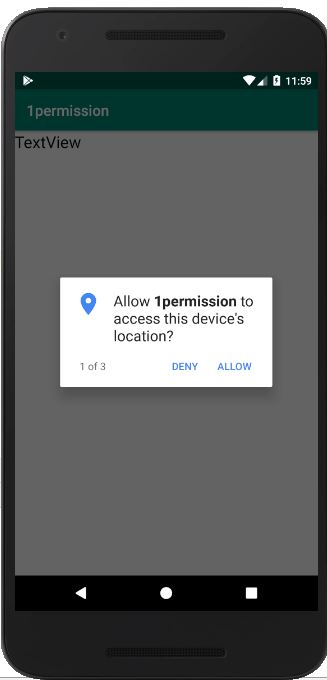
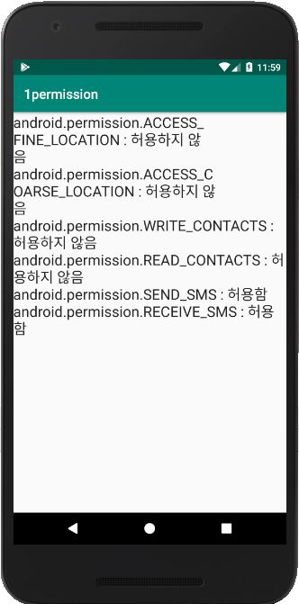
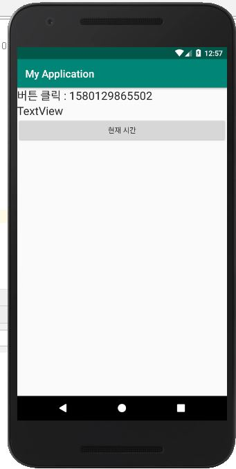

## -목차-
&nbsp;&nbsp;1.  [퍼미션 이미지](https://github.com/diqksrk/android-kotlin-practice2#1-permission) 
&nbsp;&nbsp;2.  [쓰레드 이미지](https://github.com/diqksrk/android-kotlin-practice2#1-thread) 
 
## 1. 이미지.

#### 1) permission()

  

#### 2) thread()

